<h2  align = "center" >参数可调的常微分方程求解器</h2>

<h6 align = "center">自96 曲世远 2019011455</h6>

[TOC]

### 1.引言

一阶常微分方程是工程实践领域经常需要解决的一类问题。其对应于广泛的应用场景，可能需要一种便捷快速的电子电路进行求解，以满足函数输入的一阶ODE的求解问题，便于工程信号处理等方面的使用。因此，我设计了一种参数可调的一阶ODE求解电路，本文中所涉及的一阶ODE均为如下形式的一阶ODE：
$$
u_i = a\cdot u_o + b \cdot \frac{du_o}{dt}
$$
其中$u_i$为输入信号，可以为直流电压值，也可以是交流电压值表示的以时间为自变量的函数；$u_o$为输出信号，按照上式的求解结果输出。$a, b$为方程中的参数，但在本电路中对应于可调参数的数值，具体对应关系如下文所述。

### 2.基本原理

对一阶ODE进行拉普拉斯变换，可以得到：
$$
A_u(s) = \frac{U_o(s)}{U_i(s)} = \frac{1}{a + bs}
$$
为了使得系统输出为稳定输出，则需要使极点全部位于虚轴左侧，即$ab > 0$。

通过将一阶ODE表达式进行变换，可以得到
$$
u_o = -\frac{1}{RC}\int_{t_1}^{t_2}{u_idt} + u_o(t_1)
$$
由模拟电路知识可知：
$$
a = \frac{R_1}{R_2}\\
b = RC
$$
因为在第一级电路中需要保持$R_1 = R_f$，所以固定$R_1 = R_f = 10k\Omega$，通过调节可变电阻$R_2$的阻值来调节ODE方程中参数a；在第二级电路中可以通过保持$C = 100\mu F$，调节可变电阻$R$的阻值来调节时间常数，从而调节ODE方程中的参数b。即，一阶ODE方程变为：
$$
u_i = \frac{10^4}{R_2}\cdot u_o + 10^{-4}\cdot R\cdot\frac{du_o}{dt}\\ 
$$
在验证时取几组a，b加以验证，如下部分所述。

### 3.电路仿真模拟

先令a，b = 2，3。可以由高等数学的知识解得所求ODE的解为：
$$
y(x(t)) = e^{-(2t) / 3}\int_1^t{\frac{1}{3}e^{(2\xi) / 3}x(\xi)d\xi} + c_1e^{-(2t) / 3}\\
$$
其中$c_1$为待定系数。

搭建仿真电路如下所示：

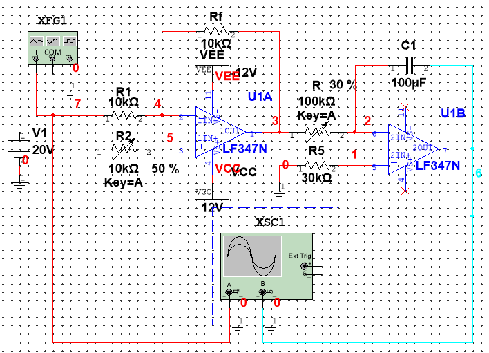

- 首先代入多组直流输入量验证$u_i$为常数时的正确性。

  当$x(t) = C$时，一阶ODE的结果可表示为$y(t) = \frac{C}{2} + c_1e^{-(2t) / 3}$，$\because u_o(0) = \frac{u_i}{2}$，$\therefore u_o = \frac{u_i}{2}$

  |     $u_i/V$     | 0.5  |  1   |  2   |  5   |  10  |  20  |
  | :-------------: | :--: | :--: | :--: | :--: | :--: | :--: |
  | $u_{o_{the}}/V$ | 0.25 | 0.5  |  1   | 2.5  |  5   |  10  |
  |     $u_o/V$     | 0.25 | 0.5  |  1   | 2.5  |  5   |  10  |
  |   $Error/\%$    |  0   |  0   |  0   |  0   |  0   |  0   |

  测量示波器波形如下图所示：

  
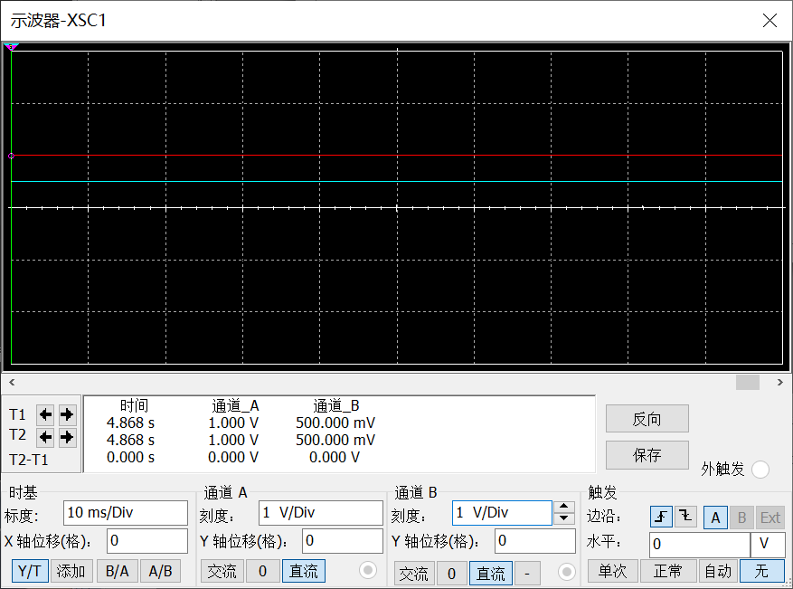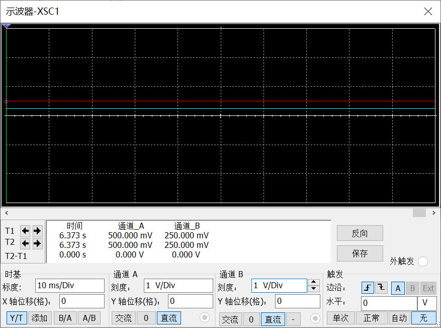

  
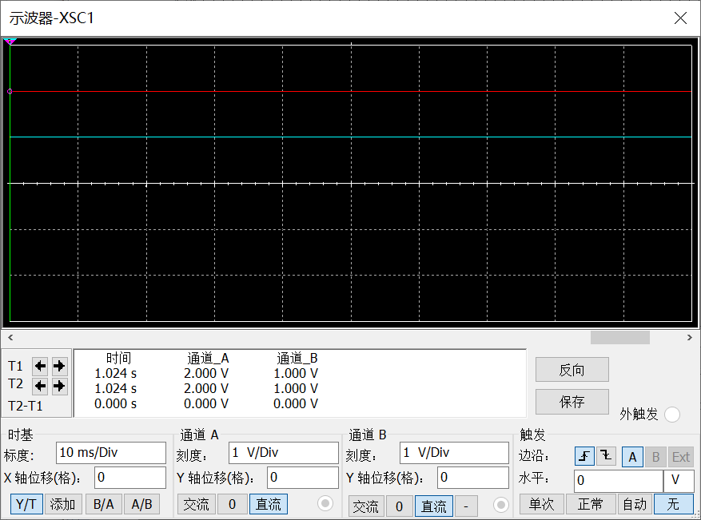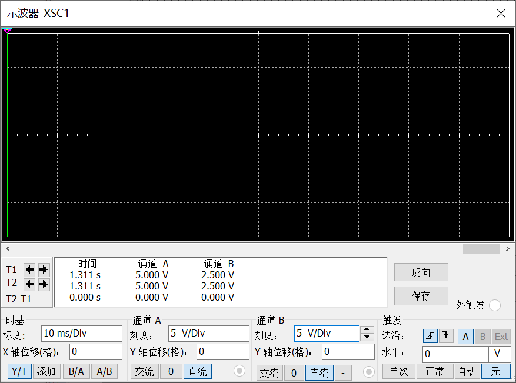

  
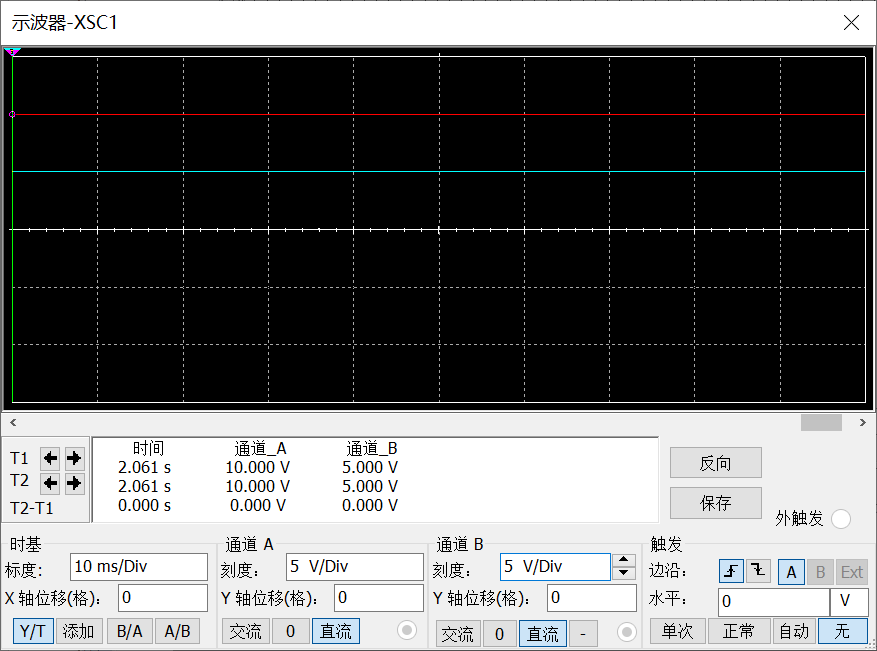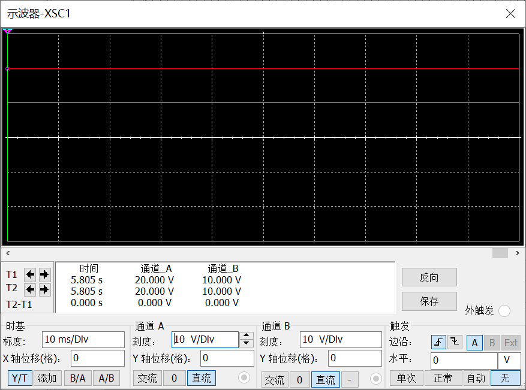

  可以看到，在输入的$x(t) = C$时，输出很好的符合理论计算值。

- 下面讨论输入量为函数时的电路求解精确度（以三角函数为例）

  因为三角函数是信号处理领域广泛应用的载波信号与传递信号，因此，主要验证本系统对涉及到三角函数的ODE方程的求解能力。
  $$
  u_i = sin(2\pi ft)\\
  y(t) = c_1e^{-(2t) / 3} + \frac{\sin(2\pi ft)}{18\pi^2f^2 + 2} - \frac{3\pi f\cos(2\pi ft)}{18\pi^2f^2 + 2}\\
  $$
  当$f= 1Hz$时，通过数学软件的计算功能，可以得到输出波形应当如下图所示：

  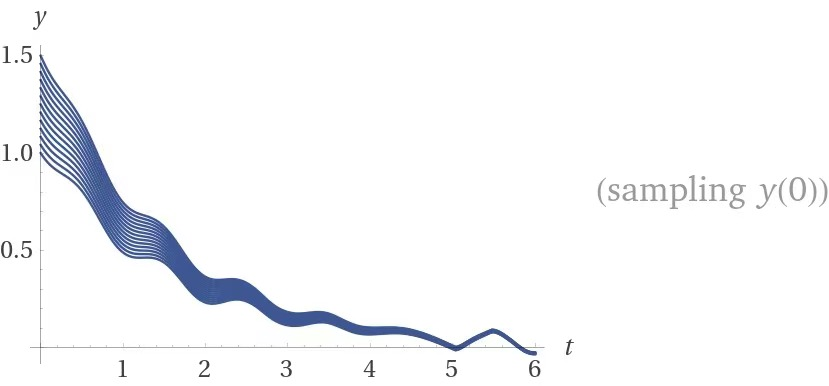

  通过Multisim仿真可以得到如下所示的波形，由于初值设定不完全相同，因此电路输出波形与数学软件分析结果有些许区别。但是分析波动，峰值等参数可以验证电路求解结果正确。

  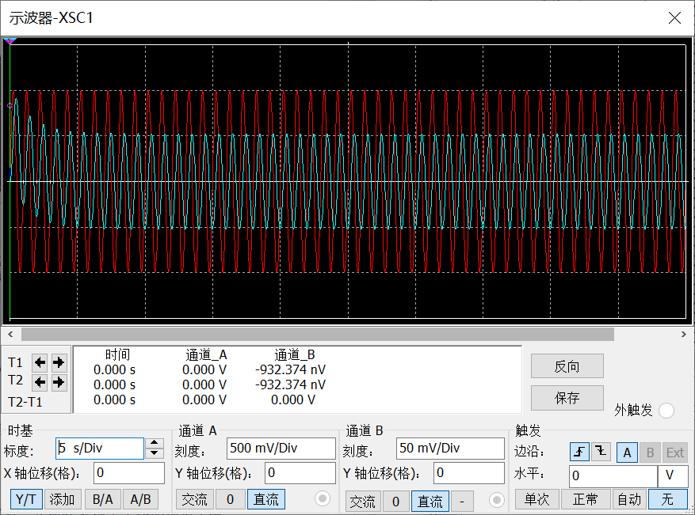

  $f = 10Hz$：

  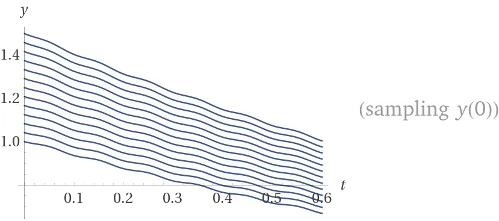

  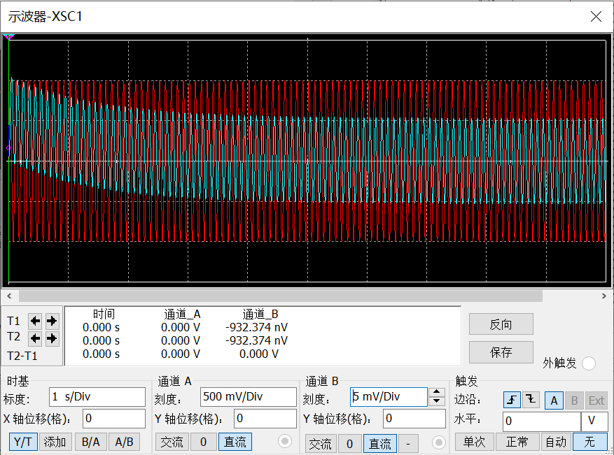

- 由于难以定量的测量解一阶ODE电路中的参数可调性（输入为常数时，输出不随参数的变化而变化，输入为函数时，很难定量测量不同输出的函数关系），因而此处不再赘述。

  不过通过定性地观察输入为正弦信号时的输出波形，并与一阶ODE的理论解比对，可以证明本电路的参数在$a\in[1, 10], b\in [1,10]$范围内可调，且输出波形正确。波形图与上一部分所示类似，此处不再截取证明。

### 4.硬件实验

根据叶老师的建议，本实验仅进行了简单的定性实验，示波器波形图及实验线路搭接如下图所示：

- 输入信号为直流量时的输出解：

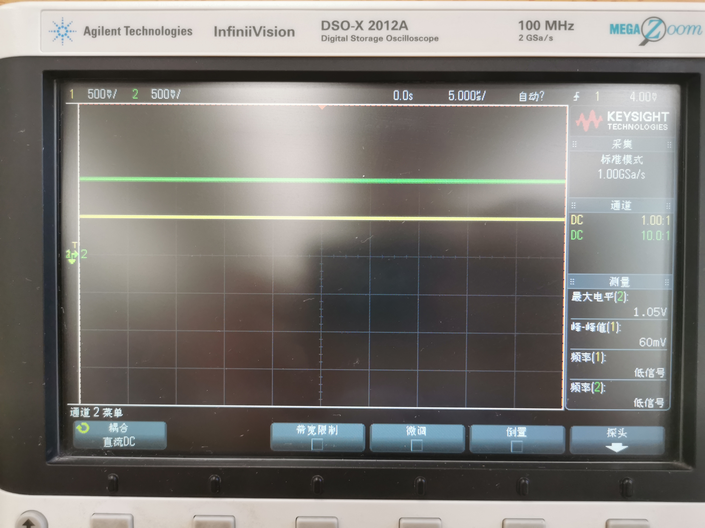

- 输入信号为正弦量时的输出波形：

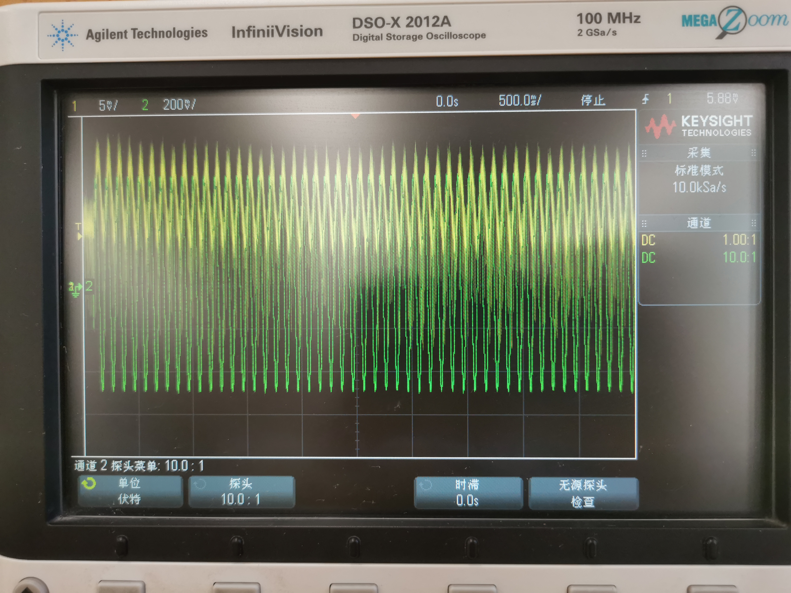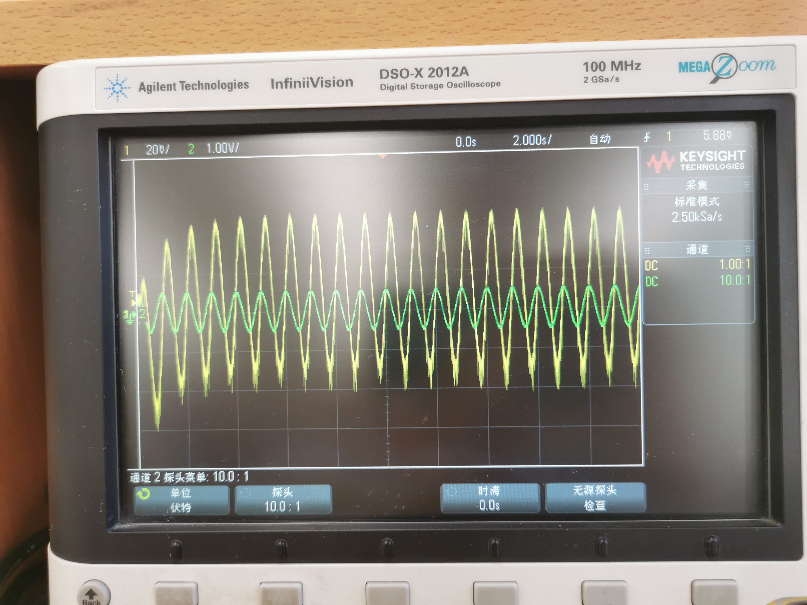

- 电路接线图：

### 5.结语

在课堂上老师与我们讨论过一阶ODE求解电路的可能实现方式，引起了我的极大兴趣。如何使用电子器件实现复杂的数学运算一直是我十分感兴趣的课题。结合高等数学与模拟电子的知识，我设计了本文章中的电路，实现了求解一阶ODE的功能。感谢叶老师在授课过程中为本实验提供的理论介绍与讲解，感谢我的微积分老师教授我的常微分方程求解相关知识。

本次实验设计使我对于一阶常微分方程有了更清晰的认识，也了解并实践体验了如何使用模拟电路实现对于高级数学表达式的求解，使我进一步认识到了模拟电子的魅力与神奇。

